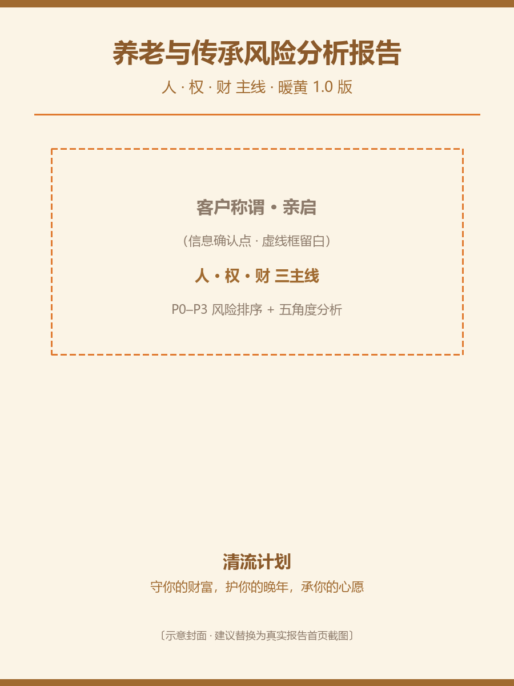

# hky-insure-risk-report · 养老与传承标准化风险分析报告

读取结构化会谈纪要，一键产出暖黄版标准化风险评估报告。报告只讲风险与逻辑，不推具体产品。

## 依赖
```
pip install python-docx pillow
```

## 内置生成器
`assets/report_template.py`：把顶部 `DATA` 字典替换为本次客户内容，`python report_template.py` 即产出 `.docx` + 家庭架构图 `family_diagram.png`。

## 安装
把本目录整体复制到 WorkBuddy 用户技能目录（Windows）：
```
copy /Y * %USERPROFILE%\.workbuddy\skills\hky-insure-risk-report\
```
或在 WorkBuddy 中安装本包。

## 用法（复制给 WorkBuddy 的指令）
请用养老与传承标准化风险分析报告生成 Skill，读取下面这份面谈纪要，产出标准版风险评估报告（人·权·财 主线，暖黄 1.0 版）。报告只讲风险与逻辑，不推具体产品，缺失信息用虚线框留白。

{粘贴结构化面谈纪要}

## Demo
见 `demo/示例-养老与传承风险分析报告.docx`

## 效果示例


> 上图为封面示意。真实渲染见 `demo/示例-养老与传承风险分析报告.docx`（用 Word / WPS 打开导出首页截图即可替换本图）。

## 服务链（hky 三件套）
本技能是「养老与传承顾问三件套」的**中游**：

1. [hky-meeting-notes](https://github.com/hukaiyi777/hky-meeting-notes) — 客户沟通 → 结构化会谈纪要（上游）
2. **hky-insure-risk-report（本仓库）** — 纪要 → 暖黄版风险评估报告
3. [hky-insure-solution](https://github.com/hukaiyi777/hky-insure-solution) — 报告 + 二次沟通 → 可落地解决方案（下游）

> 三件套彼此独立、可分别安装，建议按 1→2→3 顺序串联使用。

品牌：清流计划 · 胡开奕（MIT 许可）
